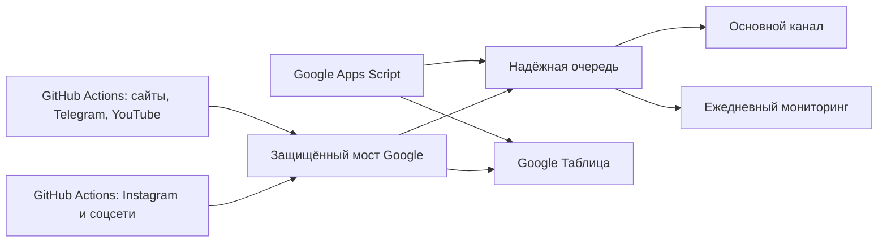

# Мониторинг СМИ СКО

Бесплатная двухконтурная система для ежедневной работы аналитического отдела. Она сохраняет простоту прежней Google Таблицы и добавляет Python-сборщики для Telegram, YouTube, сложных сайтов и городских Instagram-пабликов.

## Что уже реализовано

- Основной Telegram-канал: свежие упоминания СКО только в республиканских СМИ.
- Канал «Ежедневный мониторинг»: жалобы и происшествия из городских пабликов.
- Один Telegram-бот публикует в оба канала. Второй аккаунт и новый номер не нужны.
- 158 уникальных источников из рабочего Word-файла: 42 сайта, 41 Telegram-канал, 40 Instagram-профилей, 9 YouTube-каналов и дополнительные соцсети.
- Дедупликация по точной ссылке и по заголовку внутри одного СМИ.
- Одинаковая новость на другом сайте сохраняется отдельной ссылкой.
- Подтверждаемая очередь Telegram: ссылка запоминается только после успешной отправки.
- Повторные попытки после сетевых ошибок и ограничений Telegram.
- Локальный смысловой анализ без платного API.
- OCR текста на изображениях и опциональная расшифровка видео.
- Экспорт последнего запуска в Google Sheets, CSV и XLSX.
- Смысловой поиск старых материалов по диапазону дат без постоянного архива.
- Ограниченная техническая память с автоочисткой. Постоянного архива публикаций нет.
- Ежемесячное служебное обновление не даёт GitHub отключить расписания после 60 дней бездействия.

## Как это работает



Google Apps Script остаётся независимым круглосуточным ядром. Python работает как второй бесплатный слой: проверяет больше площадок, выполняет локальный анализ и передаёт результаты обратно в ту же таблицу. Если один слой временно недоступен, другой продолжает работу.

## Правило повторов

Допустим, `Tengrinews` и `Zakon.kz` опубликовали один материал. Обе ссылки останутся. Если `Tengrinews` повторно отдаст тот же URL или тот же заголовок под другим URL, повтор будет остановлен.

Глобального запрета по одинаковому заголовку нет: разные СМИ никогда не склеиваются в одну ссылку.

## Instagram

Instagram ограничивает автоматические запросы. Система поддерживает два бесплатных законных пути:

1. Официальный Meta API для Business/Creator-профилей.
2. Повторно используемая сессия вашего существующего Instagram-аккаунта через Instaloader.

Новый аккаунт и новый номер не нужны. Для второго пути один раз запускается [instagram-login.command](instagram-login.command), после чего расписание использует сохранённую сессию. Проверка идёт раз в час с перекрытием 72 часа.

Абсолютную гарантию для удалённых постов, Stories и заблокированных Instagram-профилей технически не может дать ни один бесплатный парсер. Ошибки не скрываются: состояние каждого источника записывается, а при длительном сбое приходит предупреждение.

## Память без архива

SQLite хранит только:

- ключи уже просмотренных ссылок с ограниченным сроком;
- очередь ещё не доставленных сообщений;
- время и результат последней проверки источника.

Тексты публикаций не накапливаются навсегда. Отправленные записи очереди удаляются через 7 дней, нерелевантные ключи через 14 дней, а ключи доставленных релевантных ссылок — через 365 дней. Это только короткие технические отпечатки, а не архив новостей.

## Быстрая проверка

```bash
./setup.command
./test.command
```

Для разработчика:

```bash
.venv/bin/sko-monitor doctor
.venv/bin/sko-monitor run --mode main --lookback-hours 72
.venv/bin/sko-monitor run --mode negative --lookback-hours 72
.venv/bin/sko-monitor search --query "паводки" --from-date 2024-01-01 --to-date 2025-12-31
```

## Структура

- `apps-script/Code.gs` — улучшенная версия прежнего Google Script.
- `apps-script/Code.original.gs` — неизменённая резервная копия исходника.
- `apps-script/SourceRegistry.gs` — реестр источников для Google Таблицы.
- `config/sources.json` — единый нормализованный реестр.
- `src/sko_monitor/` — Python-сборщики, анализ, очередь и экспорт.
- `.github/workflows/` — бесплатное расписание GitHub Actions.
- `tests/` — проверки дедупликации, анализа, источников и состояния.

Подробная установка описана в [docs/INSTALL_RU.md](docs/INSTALL_RU.md), архитектурные решения — в [docs/ARCHITECTURE_RU.md](docs/ARCHITECTURE_RU.md).
